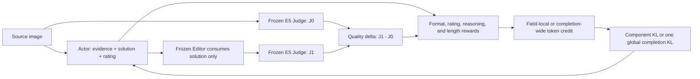

# MR-IQA-2: Fine-Grained Credit Assignment for Visual Quality Reasoning

<p align="center">
  <a href="https://huggingface.co/RobinY99/MR-IQA-2">Model weights</a> |
  <a href="docs/training.md">Training</a> |
  <a href="docs/evaluation.md">Evaluation</a> |
  <a href="docs/checkpoints.md">Checkpoints and results</a>
</p>

MR-IQA-2 trains a multimodal Actor to produce image-quality evidence, an edit
solution, and a numeric rating. A frozen Editor applies the solution and a
frozen E5 Judge measures the quality change.

> **Recommended release:** use the field-credit E5 Actor. The completion-wide
> E5 Actor is a diagnostic ablation.

## Repository contents

- `actor/`, `editor/`, `judge/`, `global/`: model roles and orchestration.
- `configs/training/`: two formal modes and two 30-step ablations.
- `data/`: 7,000 training rows, 200 validation rows, and 28,270 test rows.
- `environment/`, `requirements/`, `scripts/`: setup, training, evaluation,
  and verification.

Model artifacts are distributed from
[huggingface.co/RobinY99/MR-IQA-2](https://huggingface.co/RobinY99/MR-IQA-2).
The source E5 Judge is included as a separate artifact because it is part of
the reward and evaluation contract.

## Pipeline



Formal training uses four Actor GPUs and four Editor/Judge service GPUs. Each
update merges 4×36=144 trajectories. Five 291-update epochs reach step 1,455.
The ViT and multimodal aligner remain frozen.

## Training modes

| Mode | Reward credit | KL regularization | Length | Intended use |
| --- | --- | --- | --- | --- |
| `field_component_kl002` | Parsed field | reasoning 0.02 + rating 0.02 component KL | 5×291 | **Recommended formal mode** |
| `completion_global_kl002` | Entire eligible completion | one loss-side global completion KL, beta 0.02; `kl_in_reward=false` | 5×291 | Collapse-analysis ablation |
| `field_nokl_30step` | Parsed field | none | 30 steps | Short controlled ablation |
| `completion_nokl_30step` | Entire eligible completion | none | 30 steps | Short controlled ablation |

Exact contracts are in
[`configs/training/mode_matrix.json`](configs/training/mode_matrix.json) and
[`global/contracts/reward_and_kl.md`](global/contracts/reward_and_kl.md).

## Quick start

Full training and evaluation require Linux, CUDA 13.0, and eight visible
NVIDIA GPUs.

```bash
git clone https://github.com/RobinY99/MR-IQA-2.git
cd MR-IQA-2

cp .env.example .env
# Edit .env with paths to the downloaded Actor, Editor, Judge, images,
# original-score cache, and validated FlashAttention wheel.

conda env create -f environment/actor-judge.yml
conda env create -f environment/editor.yml
conda run -n mr_iqa_actor_judge \
  python -m pip install -r requirements/actor-judge.txt
conda run -n mr_iqa_editor \
  python -m pip install -r requirements/editor.txt
# Install the FlashAttention wheel documented in environment/README.md.

python -m pip install -r requirements/publish.txt
huggingface-cli download Qwen/Qwen3.5-4B \
  --revision 851bf6e806efd8d0a36b00ddf55e13ccb7b8cd0a \
  --local-dir checkpoints/qwen3.5-4b
huggingface-cli download RobinY99/MR-IQA-2 \
  --include "judge/source-e5/**" \
  --local-dir checkpoints/mr-iqa-2
huggingface-cli download RobinY99/MR-IQA-2 \
  training_assets/original_score_cache.sqlite \
  --local-dir checkpoints/mr-iqa-2

bash scripts/test_release.sh --static
bash scripts/train.sh --mode field_component_kl002 --print-plan
```

Point the runtime at the downloaded Judge and J0 cache:

```dotenv
JUDGE_MODEL_PATH=<repository-root>/checkpoints/mr-iqa-2/judge/source-e5
JUDGE_MANIFEST_PATH=<repository-root>/checkpoints/mr-iqa-2/judge/source-e5/provenance.json
ORIGINAL_SCORE_CACHE_PATH=<repository-root>/checkpoints/mr-iqa-2/training_assets/original_score_cache.sqlite
```

Keep the remaining variables from `.env.example`; the launcher validates them.

Validate the complete local configuration before loading a model:

```bash
bash scripts/train.sh --mode field_component_kl002 --validate-config
```

Run a one-update end-to-end smoke test, then the recommended formal mode:

```bash
# Use a fresh ID and fresh large-storage directory for every invocation.
export RUN_ID="smoke-field-$(date -u +%Y%m%dT%H%M%SZ)-${RANDOM}"
export OUTPUT_ROOT="<large-storage-root>/mr-iqa-2/${RUN_ID}"
export VF_STORAGE_ROOT="${OUTPUT_ROOT}"
export VF_MIN_FREE_GIB="<host-appropriate-smoke-threshold>"
bash scripts/train.sh --mode field_component_kl002 --smoke

export RUN_ID="field-formal-$(date -u +%Y%m%dT%H%M%SZ)-${RANDOM}"
export OUTPUT_ROOT="<large-storage-root>/mr-iqa-2/${RUN_ID}"
export VF_STORAGE_ROOT="${OUTPUT_ROOT}"
export VF_MIN_FREE_GIB=500
bash scripts/train.sh --mode field_component_kl002
```

Use a new `RUN_ID` and output directory for every launch. Formal training runs
five 291-update epochs and validates all 200 rows between epochs. Only a
`promoted` checkpoint can seed the next epoch. `WANDB_MODE=offline` is the
default.

## Evaluation

Actor-only evaluation measures output validity and rating PLCC/SRCC/MAE without
loading the Editor or Judge:

```bash
EVAL_ACTOR_ONLY=1 \
ACTOR_MODEL_PATH=<actor-checkpoint> \
EVAL_IMAGE_ROOT=<dataset-image-root> \
bash scripts/evaluate.sh test
```

Full evaluation uses eight-shard Actor inference, a complete Editor barrier,
then the frozen E5 Judge:

```bash
ACTOR_MODEL_PATH=<actor-checkpoint> \
EVAL_IMAGE_ROOT=<dataset-image-root> \
bash scripts/evaluate.sh validation

ACTOR_MODEL_PATH=<actor-checkpoint> \
EVAL_IMAGE_ROOT=<dataset-image-root> \
bash scripts/evaluate.sh test
```

Use `all` for validation plus all six test datasets. See
[`docs/evaluation.md`](docs/evaluation.md).

## Released checkpoints

| Artifact | Step | Validation PLCC / SRCC / MAE | Status |
| --- | ---: | --- | --- |
| Source E5 Judge | 725 | 0.947970 / 0.934169 / 0.439320 | Frozen reward/evaluation model |
| Field Actor E5 | 1,455 | 0.935394 / 0.919533 / 0.354589 | **Recommended; best/final** |
| Completion Actor E5 | 1,455 | 0.928980 / 0.915821 / 0.997127 | Diagnostic final; collapsed |

Full training history and six-dataset results are in
[`docs/checkpoints.md`](docs/checkpoints.md).

## Reproducibility and safety checks

```bash
# Dependency-free: schemas, syntax, privacy patterns, and blob policy.
bash scripts/test_release.sh --static

# Full CPU contract suite after installing requirements/test.txt + CPU PyTorch.
bash scripts/test_release.sh
```

Training audits shard completeness, update counts, finite rewards/KL, and KL
application counts. Completion-global mode requires one global-completion KL
application and zero component-KL applications per valid update.

## License and citation

Original code is MIT licensed. Model weights, datasets, dependencies, and the
frozen Editor retain their upstream terms. Qwen-derived Actor/Judge weights
and the pinned FLUX.2-klein-4B Editor are Apache-2.0. See
[`THIRD_PARTY_NOTICES.md`](THIRD_PARTY_NOTICES.md).

Please cite the software metadata in [`CITATION.cff`](CITATION.cff). If you use
MR-IQA as well, cite its associated paper and repository separately.
