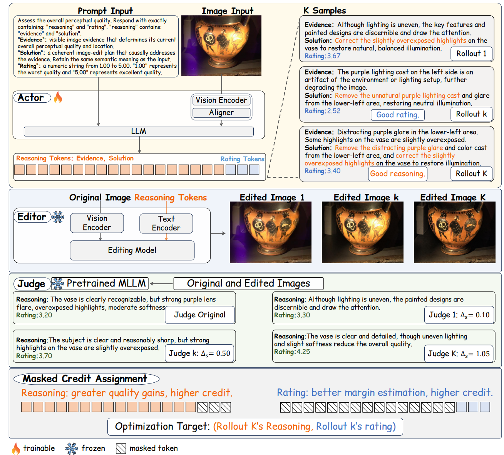

<h1> MR-IQA-2: Masked Credit Assignment for Visual Quality Reasoning</h1>

[Model weights](https://huggingface.co/RobinY99/MR-IQA-2) · [Training](docs/training.md) · [Evaluation](docs/evaluation.md)

MR-IQA-2 couples a multimodal Actor, a frozen FLUX.2-klein-4B Editor, and a
frozen E5 Judge. Masked credit assigns reasoning and rating rewards only to
their eligible completion tokens.



## PLCC/SRCC performance

Actor-only rating performance on six generalization datasets. Each entry is
`PLCC / SRCC`; Average is the unweighted macro mean.

| Model | KonIQ-10K | SPAQ | LIVE-W | AGIQA-3K | KADID-10K | CSIQ | Average |
| --- | ---: | ---: | ---: | ---: | ---: | ---: | ---: |
| [MR-IQA](https://github.com/RobinY99/MR-IQA) | 0.949 / 0.931 | 0.892 / 0.897 | 0.899 / 0.883 | 0.804 / 0.732 | 0.672 / 0.683 | 0.767 / 0.732 | 0.831 / 0.810 |
| MR-IQA-2 | 0.937 / 0.917 | 0.900 / 0.899 | 0.893 / 0.863 | 0.809 / 0.739 | 0.667 / 0.669 | 0.824 / 0.785 | 0.838 / 0.812 |

MR-IQA values are from the released Qwen3-VL-2B result in the
[MR-IQA paper](https://arxiv.org/pdf/2606.29760). MR-IQA-2 uses the released
masked-credit E5 Actor at step 1,455. Exact coefficients and valid-row counts
are in [checkpoint results](docs/checkpoints.md#field-e5-recommended).

## Installation

```bash
git clone https://github.com/RobinY99/MR-IQA-2.git
cd MR-IQA-2
bash scripts/setup_envs.sh --profile inference
```

The inference profile creates separate Actor/Judge and Editor environments
because their validated dependency versions differ. Full training setup is in
[environment/README.md](environment/README.md).

## Single-image inference

Run Actor → Editor → E5 Judge sequentially on one physical GPU:

```bash
python examples/quick_start.py /absolute/path/to/input.jpg --gpu 0
```

The first run downloads the public `actor/`, `editor/`, and `judge/` folders
from [RobinY99/MR-IQA-2](https://huggingface.co/RobinY99/MR-IQA-2). The three
stages run in separate processes, so their model memory is not resident at the
same time. No HTTP service is started.

If the host has multiple CUDA toolkits, select the compatible toolkit
explicitly:

```bash
python examples/quick_start.py /absolute/path/to/input.jpg \
  --gpu 0 \
  --cuda-home /usr/local/cuda
```

For already downloaded models:

```bash
python examples/quick_start.py /absolute/path/to/input.jpg \
  --actor-model checkpoints/mr-iqa-2/actor \
  --judge-model checkpoints/mr-iqa-2/judge \
  --editor-model checkpoints/mr-iqa-2/editor \
  --local-files-only
```

Outputs are written to `outputs/quick_start/`:

- `actor_raw.txt`: exact Actor completion;
- `assessment.json`: parsed evidence, solution, and rating;
- `edited.png`: edited image;
- `evaluation.json`: Judge `J0`, `J1`, and `J1-J0`;
- `result.json`: combined provenance and results.

This path was smoke-tested end to end on one NVIDIA A6000 (48 GB). The test
produced `J0=3.42`, `J1=4.12`, and `J1-J0=+0.70`, forwarded the Actor solution
verbatim, restored the original `512×336` image size, and released all GPU
memory after exit.

## Eight-GPU deployment

Training uses four Actor ranks on GPUs 0–3 and four Editor/Judge service lanes
on GPUs 4–7.

| GPU | Process | Editor URL | Judge URL |
| ---: | --- | --- | --- |
| 0–3 | Actor ranks 0–3 | — | — |
| 4 | Editor + Judge lane 0 | `127.0.0.1:8212` | `127.0.0.1:8204` |
| 5 | Editor + Judge lane 1 | `127.0.0.1:8213` | `127.0.0.1:8205` |
| 6 | Editor + Judge lane 2 | `127.0.0.1:8214` | `127.0.0.1:8206` |
| 7 | Editor + Judge lane 3 | `127.0.0.1:8215` | `127.0.0.1:8207` |

Evaluation uses all eight GPUs in three ordered phases: eight Actor shards,
an eight-lane Editor barrier, then eight Judge lanes. Print the resolved plan
without loading models:

```bash
bash scripts/train.sh --mode field_component_kl002 --print-plan
bash scripts/evaluate.sh --print-plan
```

### Local HTTP endpoints

Services bind to `127.0.0.1` and exchange absolute local image paths.

| Service | Endpoint | Input | Output |
| --- | --- | --- | --- |
| Editor | `GET /health` | — | readiness and runtime metadata |
| Editor | `POST /edit` | `image_path`, edit prompt | `edited_path`, seed, status |
| Judge | `GET /health` | — | readiness and model provenance |
| Judge | `POST /score_image` | `image_path`, optional `repeats` | mean score and raw outputs |

```bash
curl -fsS http://127.0.0.1:8212/health | python -m json.tool
curl -fsS http://127.0.0.1:8204/health | python -m json.tool
```

Do not expose these service ports publicly.

## Training

The released preset is `field_component_kl002`: masked credit, reasoning and
rating component KL with beta 0.02, five epochs, and 291 optimizer updates per
epoch. Validate the resolved configuration before loading models:

```bash
bash scripts/test_release.sh --static
bash scripts/train.sh --mode field_component_kl002 --validate-config
```

Formal launches require online Weights & Biases telemetry. Data, J0 cache,
checkpoint, resume, and launch contracts are documented in
[docs/training.md](docs/training.md).

## Evaluation

Set `ACTOR_MODEL_PATH` and `EVAL_IMAGE_ROOT` in a dedicated environment file,
then run one of the following:

```bash
ENV_FILE="$PWD/.env.eval" EVAL_ACTOR_ONLY=1 bash scripts/evaluate.sh test
ENV_FILE="$PWD/.env.eval" bash scripts/evaluate.sh validation
ENV_FILE="$PWD/.env.eval" bash scripts/evaluate.sh test
ENV_FILE="$PWD/.env.eval" bash scripts/evaluate.sh all
```

`all` runs validation and all six generalization datasets. Output schemas and
resume rules are in [docs/evaluation.md](docs/evaluation.md).

## Verification

```bash
bash scripts/test_release.sh --static
bash scripts/test_release.sh
```

## License

Original code is MIT licensed. Qwen-derived Actor/Judge weights and the pinned
FLUX.2-klein-4B Editor retain their upstream Apache-2.0 terms. See
[THIRD_PARTY_NOTICES.md](THIRD_PARTY_NOTICES.md).
