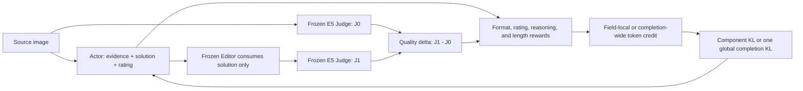

# MR-IQA-2: Fine-Grained Credit Assignment for Visual Quality Reasoning

<p align="center">
  <a href="https://huggingface.co/RobinY99/MR-IQA-2">Model weights</a> |
  <a href="docs/training.md">Training</a> |
  <a href="docs/evaluation.md">Evaluation</a> |
  <a href="docs/checkpoints.md">Checkpoints and results</a>
</p>

MR-IQA-2 studies how token-level reward credit and KL regularization affect a
multimodal Actor that predicts image-quality evidence, an edit solution, and a
numeric rating. A frozen image Editor applies only the proposed `solution`, and
a frozen E5 Judge measures the quality change. The repository releases the
training integrations, four controlled training modes, relative-path data
manifests, validation/generalization runners, and provenance checks used by the
experiments.

> **Recommended release:** use the field-credit E5 Actor. The completion-wide
> E5 Actor is retained only as a diagnostic ablation because its solution field
> collapsed; the intermediate E4 checkpoint is not released.

## What is released

- `actor/`: GRPO Actor plugin, reward and KL routing, four-rank trajectory I/O,
  training stage, and eight-shard inference.
- `editor/`: frozen FLUX.2 Editor service and client. **Editor training is not
  included**; the Editor is an external frozen service throughout this work.
- `judge/`: deterministic frozen E5 Judge service and checkpoint contract.
- `global/`: cross-role reward, KL, orchestration, and provenance contracts.
- `configs/training/`: two formal modes and two 30-step no-KL ablations.
- `data/`: one 7,000-row training manifest, one 200-row validation manifest,
  and six test manifests totaling 28,270 rows. Images are not redistributed.
- `environment/` and `requirements/`: separate, pinned Actor/Judge and Editor
  Python 3.12.13 environments.
- `scripts/`: public training, Actor-only evaluation, full
  Actor→Editor→Judge evaluation, and release checks.

Model artifacts are distributed from
[huggingface.co/RobinY99/MR-IQA-2](https://huggingface.co/RobinY99/MR-IQA-2).
The source E5 Judge is included as a separate artifact because it is part of
the reward and evaluation contract.

## Pipeline



The formal training topology uses four Actor GPUs and four Editor/Judge service
GPUs. Every optimizer update merges 36 trajectories from each Actor rank for
144 global trajectories. Each formal epoch contains 291 optimizer updates;
five epochs reach global step 1,455. The ViT and multimodal aligner stay frozen
in every released mode.

## Training modes

| Mode | Reward credit | KL regularization | Length | Intended use |
| --- | --- | --- | --- | --- |
| `field_component_kl002` | Parsed field | reasoning 0.02 + rating 0.02 component KL | 5×291 | **Recommended formal mode** |
| `completion_global_kl002` | Entire eligible completion | one loss-side global completion KL, beta 0.02; `kl_in_reward=false` | 5×291 | Collapse-analysis ablation |
| `field_nokl_30step` | Parsed field | none | 30 steps | Short controlled ablation |
| `completion_nokl_30step` | Entire eligible completion | none | 30 steps | Short controlled ablation |

The exact machine-readable contracts are in
[`configs/training/mode_matrix.json`](configs/training/mode_matrix.json). See
[`global/contracts/reward_and_kl.md`](global/contracts/reward_and_kl.md) before
changing a mask or KL mode.

## Quick start

The full workflow targets Linux, CUDA 13.0, and eight visible NVIDIA GPUs. A
CPU machine can run release and contract tests but cannot reproduce the full
training topology.

```bash
git clone https://github.com/RobinY99/MR-IQA-2.git
cd MR-IQA-2

cp .env.example .env
# Edit .env with paths to the downloaded Actor, Editor, Judge, images,
# original-score cache, and validated FlashAttention wheel.

conda env create -f environment/actor-judge.yml
conda env create -f environment/editor.yml
conda run -n mr_iqa_actor_judge \
  python -m pip install -r requirements/actor-judge.txt
conda run -n mr_iqa_editor \
  python -m pip install -r requirements/editor.txt
# Install the separately obtained, validated FlashAttention wheel into the
# Actor/Judge environment as documented in environment/README.md.

python -m pip install -r requirements/publish.txt
huggingface-cli download Qwen/Qwen3.5-4B \
  --revision 851bf6e806efd8d0a36b00ddf55e13ccb7b8cd0a \
  --local-dir checkpoints/qwen3.5-4b
huggingface-cli download RobinY99/MR-IQA-2 \
  --include "judge/source-e5/**" \
  --local-dir checkpoints/mr-iqa-2
huggingface-cli download RobinY99/MR-IQA-2 \
  training_assets/original_score_cache.sqlite \
  --local-dir checkpoints/mr-iqa-2

bash scripts/test_release.sh --static
bash scripts/train.sh --mode field_component_kl002 --print-plan
```

Install the pinned packages and run the dependency-backed CPU tests as
described in [`environment/README.md`](environment/README.md). Download the
weights at an immutable Hugging Face revision, copy the artifact settings from
`.env.example`, and do not commit `.env`. The initial Actor is the Apache-2.0
[`Qwen/Qwen3.5-4B`](https://huggingface.co/Qwen/Qwen3.5-4B/tree/851bf6e806efd8d0a36b00ddf55e13ccb7b8cd0a)
revision shown above.

Point the runtime at the downloaded Judge and portable J0 cache:

```dotenv
JUDGE_MODEL_PATH=<repository-root>/checkpoints/mr-iqa-2/judge/source-e5
JUDGE_MANIFEST_PATH=<repository-root>/checkpoints/mr-iqa-2/judge/source-e5/provenance.json
ORIGINAL_SCORE_CACHE_PATH=<repository-root>/checkpoints/mr-iqa-2/training_assets/original_score_cache.sqlite
```

Keep the remaining identity and cache-contract variables from `.env.example`
unchanged. The launcher validates them automatically. The portable cache
contains 10,073 source scores and no ground truth, raw Judge completion,
reasoning text, image bytes, or private absolute paths.

Validate the complete local configuration before loading a model:

```bash
bash scripts/train.sh --mode field_component_kl002 --validate-config
```

Run a one-update end-to-end smoke test, then the recommended formal mode:

```bash
# Use a fresh ID and fresh large-storage directory for every invocation.
export RUN_ID="smoke-field-$(date -u +%Y%m%dT%H%M%SZ)-${RANDOM}"
export OUTPUT_ROOT="<large-storage-root>/mr-iqa-2/${RUN_ID}"
export VF_STORAGE_ROOT="${OUTPUT_ROOT}"
export VF_MIN_FREE_GIB="<host-appropriate-smoke-threshold>"
bash scripts/train.sh --mode field_component_kl002 --smoke

export RUN_ID="field-formal-$(date -u +%Y%m%dT%H%M%SZ)-${RANDOM}"
export OUTPUT_ROOT="<large-storage-root>/mr-iqa-2/${RUN_ID}"
export VF_STORAGE_ROOT="${OUTPUT_ROOT}"
export VF_MIN_FREE_GIB=500
bash scripts/train.sh --mode field_component_kl002
```

The formal launcher chains five 291-update epochs, resumes each epoch from the
previous checkpoint, and runs the complete 200-row validation between epochs.
Each epoch moves `quarantined → technically_valid → promoted` only after the
complete 200-row, eight-shard Actor→Editor barrier→Judge observational gate;
the next epoch resolves only that promoted manifest, while
`--skip-validation --epochs 1` deliberately leaves an unpromoted checkpoint
that cannot seed another epoch.
Never reuse a `RUN_ID` or an existing output directory. `OUTPUT_ROOT` and
`VF_STORAGE_ROOT` must resolve to the same new location on storage with enough
free capacity; 500 GiB is the recommended formal preflight threshold.
`VF_MIN_FREE_GIB` may be lowered for a one-update smoke only after checking the
host's actual needs.

`WANDB_MODE=offline` is supported and is the reproducible default. Set
`WANDB_MODE=online` only when remote tracking is desired and credentials are
configured outside the repository. The smoke path disables W&B internally.
All other machine-specific values stay in `.env`.

## Evaluation

Actor-only evaluation measures output validity and rating PLCC/SRCC/MAE without
loading the Editor or Judge:

```bash
EVAL_ACTOR_ONLY=1 \
ACTOR_MODEL_PATH=<actor-checkpoint> \
EVAL_IMAGE_ROOT=<dataset-image-root> \
bash scripts/evaluate.sh test
```

Full evaluation preserves the original sequence: eight-shard Actor inference,
a complete Editor barrier, then the frozen E5 Judge. Configure the Editor,
Judge, and original-score cache in `.env`, then run:

```bash
ACTOR_MODEL_PATH=<actor-checkpoint> \
EVAL_IMAGE_ROOT=<dataset-image-root> \
bash scripts/evaluate.sh validation

ACTOR_MODEL_PATH=<actor-checkpoint> \
EVAL_IMAGE_ROOT=<dataset-image-root> \
bash scripts/evaluate.sh test
```

Use `all` to run validation plus all six test datasets. See
[`docs/evaluation.md`](docs/evaluation.md) for output files, resume behavior,
and metric interpretation.

## Released checkpoints

| Artifact | Step | Validation PLCC / SRCC / MAE | Status |
| --- | ---: | --- | --- |
| Source E5 Judge | 725 | 0.947970 / 0.934169 / 0.439320 | Frozen reward/evaluation model |
| Field Actor E5 | 1,455 | 0.935394 / 0.919533 / 0.354589 | **Recommended; best/final** |
| Completion Actor E5 | 1,455 | 0.928980 / 0.915821 / 0.997127 | Diagnostic final; collapsed |

The E4 completion checkpoint is intentionally excluded from the model release.
Full training history and released six-dataset results are in
[`docs/checkpoints.md`](docs/checkpoints.md).

## Reproducibility and safety checks

```bash
# Dependency-free: schemas, syntax, privacy patterns, and blob policy.
bash scripts/test_release.sh --static

# Full CPU contract suite after installing requirements/test.txt + CPU PyTorch.
bash scripts/test_release.sh
```

Training additionally audits four-rank shard completeness, optimizer and
scheduler update counts, reward/KL finiteness, and KL application counts. For
the completion-global mode, every valid update must apply global completion KL
exactly once and component KL zero times.

## Limitations

- The two formal runs change both reward-credit routing and KL routing. With
  one seed per configuration, they do not identify either change as a sole
  causal factor.
- The completion-wide run collapses to a generic house-edit solution even
  though rating PLCC/SRCC remain high. Rating correlation is not a proxy for
  grounded solution diversity.
- Field credit avoids the catastrophic house-solution collapse in this run,
  but still develops a frequent lexical editing skeleton. Field masks mitigate
  cross-field credit leakage; they do not guarantee semantic grounding.
- The quality Judge scores visual quality change, not source-image semantic
  fidelity. Downstream work should add relevance checks or semantic
  guardrails.
- Images, the frozen Editor, upstream base weights, and some runtime artifacts
  are not redistributed by the GitHub source repository. Obtain them under
  their own licenses and verify their provenance.
- The initial Qwen Actor is Apache-2.0. The frozen
  [`black-forest-labs/FLUX.2-klein-4B`](https://huggingface.co/black-forest-labs/FLUX.2-klein-4B/tree/e7b7dc27f91deacad38e78976d1f2b499d76a294)
  Editor at revision `e7b7dc27f91deacad38e78976d1f2b499d76a294` is not
  redistributed by this repository; the pinned 4B model is Apache-2.0 and
  users should retain its upstream notices and usage guidance.

See [`docs/reproducibility.md`](docs/reproducibility.md) and
[`docs/privacy.md`](docs/privacy.md) for the complete release boundary.

## License and citation

The original code in this repository is released under the MIT License. Model
weights, datasets, dependencies, and the frozen Editor remain subject to their
respective upstream terms. The Qwen-derived Actor/Judge weights are Apache-2.0;
the non-redistributed FLUX.2-klein-4B Editor at the pinned revision above is
also Apache-2.0. See
[`THIRD_PARTY_NOTICES.md`](THIRD_PARTY_NOTICES.md).

Please cite the software metadata in [`CITATION.cff`](CITATION.cff). If you use
MR-IQA as well, cite its associated paper and repository separately.
